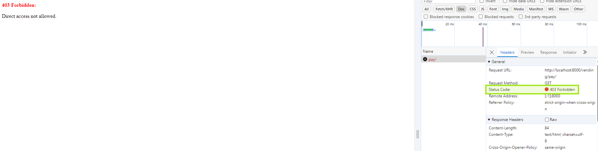

# Vending-Machine
- This is vending machine app built via Django (Python).
- Simple operations include product selection, payment and validation.

# Prerequisite
### Docker
- https://www.docker.com/products/docker-desktop/

# Related screenshot

### Product selection
- URL: http://localhost:8000/vending/v1/
- Selection of all product list.
> 

### Payment checkout
- URL: http://localhost:8000/vending/checkout/
- Payment checkout page for multiple payment method.
> 
> 

### Payment result
- URL: http://localhost:8000/vending/pay/
- Payment validation and result.
> 

### Block direct access
- Block all direct access to intermediate page.
> 

### [Validation] Item price
- Validate actual price of item from global values.
> 

### [Validation] Cash amount
- Validate cash amount inserted by buyer.
> 
> 

